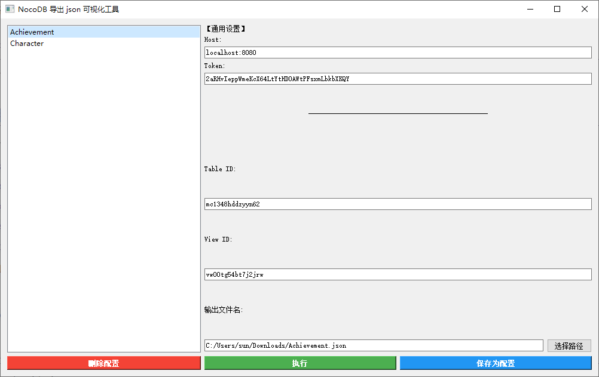
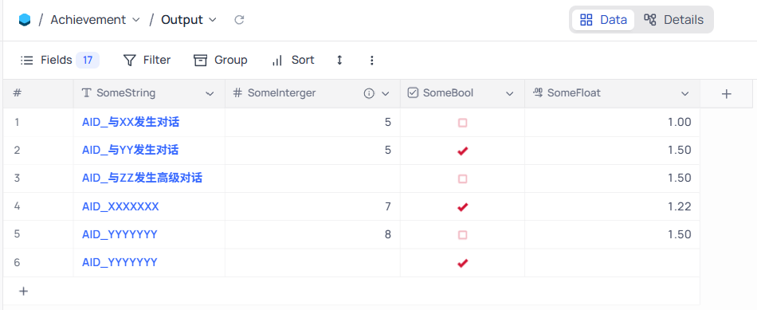
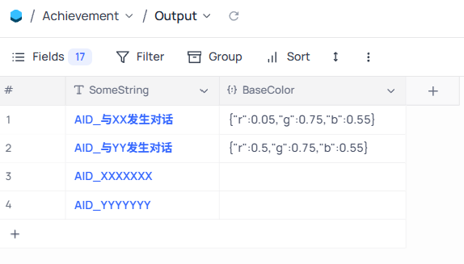
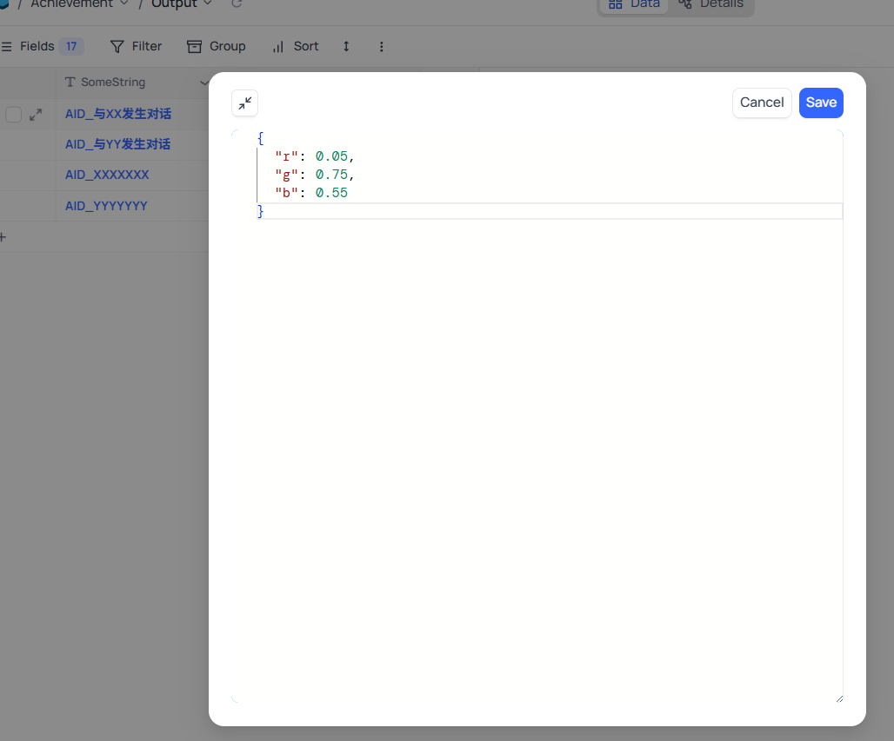
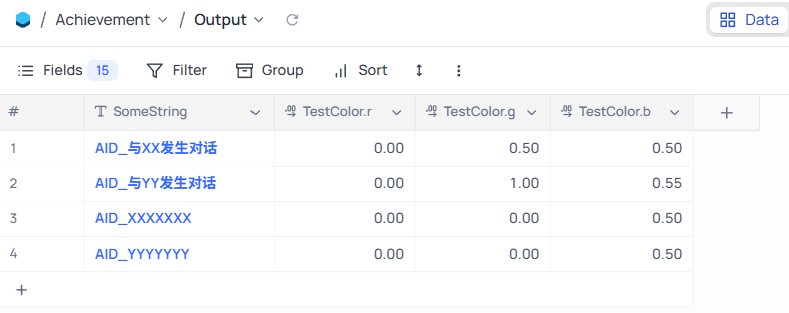
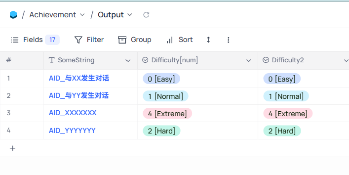
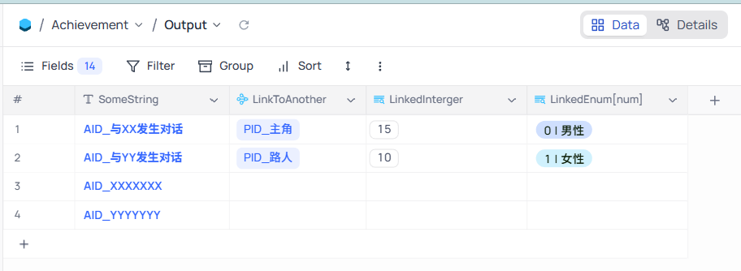
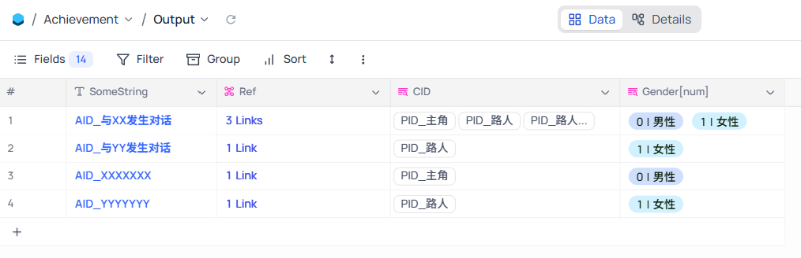

## 工具说明

本工具是 [nocodb: Open Source Airtable Alternative](https://github.com/nocodb/nocodb) 的一个外置工具，可以实现导出 NocoDB 的表格为 json 文件。

本工具主要应用于`游戏开发领域`，旨在游戏开发中利用多维表格的优势进行填表工作，替代传统填表工具 Excel。

本工具代码和原理都很简单，仅有 2 个 py 文件，可快速上手自定义表格内容和输出的 json 格式映射方式。

## 运行方式

使用安装了 `pyqt5` 的 `python` 运行 `ui.py` 

## 使用说明

如果是第一次使用，不存在下图中显示的配置，需要自行输入以下的内容：

- `Host`：NocoDB 运行的地址和端口
- `Token`：NocoDB 的 Token，在 NocoDB 前端页面中获取
- `Table ID`：需要导出的表格 ID，在 NocoDB 前端页面中获取
- `View ID`：需要导出的表格的视图 ID，在 NocoDB 前端页面中获取
- `输出文件名`：某个路径上的 json 文件名。【❗ 要求是文件名，不是路径名】

输入后可以 `保存为配置`，在左侧配置栏显示，点击任一配置，都会将其中的内容应用到输入框中。



`确保 NocoDB 运行中`，点击 `执行`，将导出表格为 json 文件。

## Feature

首先需要明确几个概念：

- 字段名：title，表格头的字符串
- 字段存储类型：dt，例如：varchar、integer、text、boolean、decimal
- 字段交互类型: uidt，例如：SingleSelect、Decimal、Lookup、Checkbox

在本工具中，导出 json 实现了如下特性（存在优先级，顺序如下）：

- 跳过 Id 字段（表格最左侧的自动增长的数字字段）
- 跳过空的数据
- 跳过交互类型 `Links`
- 交互类型为 `JSON` 时，正确加载 json 字符串为嵌套的 json 对象
- 交互类型为 `Lookup`（Many-Many）时，实际存储了数组数据，递归处理每个元素，最终还是返回数组 【优化了外链字段的使用体验】
- 字段名后缀是 `[num]`，尝试提取开头数字作为值，即允许在数字后标注字符串，主要用于 `SingleSelect` 类型和 `Lookup`类型字段【优化了 枚举类型 和 外链字段 的使用体验】
- 存储类型为 `boolean` 时，将 API 通信请求收到的 0/1 值转为 bool 值
- 字段名中包含 `.` 时，将其分割为 json object 【主要用于嵌套的 json 对象】
- 字段名后缀 `[num]` 会被移除
- 外链目前仅对 string、int、bool、float 等基本类型支持完善，对其他外链类型例如 Json 等支持有缺失。

## 示例：基本类型 string、int、bool、float

前端表格如下：



导出 json 后如下：

```json
[
  {
    "SomeString": "AID_与XX发生对话",
    "SomeInterger": 5,
    "SomeBool": false,
    "SomeFloat": 1.0
  },
  {
    "SomeString": "AID_与YY发生对话",
    "SomeInterger": 5,
    "SomeBool": true,
    "SomeFloat": 1.5
  },
  {
    "SomeString": "AID_与ZZ发生高级对话",
    "SomeBool": false,
    "SomeFloat": 1.5
  },
  {
    "SomeString": "AID_XXXXXXX",
    "SomeInterger": 7,
    "SomeBool": true,
    "SomeFloat": 1.22
  },
  {
    "SomeString": "AID_YYYYYYY",
    "SomeInterger": 8,
    "SomeBool": false,
    "SomeFloat": 1.5
  },
  {
    "SomeString": "AID_YYYYYYY",
    "SomeBool": true
  }
]
```

## 示例：Json 字段

前端表格如下：





导出 json 后如下：

```json
[
  {
    "SomeString": "AID_与XX发生对话",
    "BaseColor": {
      "r": 0.05,
      "g": 0.75,
      "b": 0.55
    }
  },
  {
    "SomeString": "AID_与YY发生对话",
    "BaseColor": {
      "r": 0.5,
      "g": 0.75,
      "b": 0.55
    }
  },
  {
    "SomeString": "AID_XXXXXXX"
  },
  {
    "SomeString": "AID_YYYYYYY"
  }
]
```

## 示例：`.` 实现 json 嵌套

前端表格如下：



导出 json 后如下：

```json
[
  {
    "SomeString": "AID_与XX发生对话",
    "TestColor": {
      "r": 0.0,
      "g": 0.5,
      "b": 0.5
    }
  },
  {
    "SomeString": "AID_与YY发生对话",
    "TestColor": {
      "r": 0.0,
      "g": 1.0,
      "b": 0.55
    }
  },
  {
    "SomeString": "AID_XXXXXXX",
    "TestColor": {
      "r": 0.0,
      "g": 0.0,
      "b": 0.5
    }
  },
  {
    "SomeString": "AID_YYYYYYY",
    "TestColor": {
      "r": 0.0,
      "g": 0.0,
      "b": 0.5
    }
  }
]
```


## 示例：`[num]` 后缀提取数字

前端表格如下：



导出 json 后如下：

```json
[
  {
    "SomeString": "AID_与XX发生对话",
    "Difficulty": 0,
    "Difficulty2": "0 [Easy]"
  },
  {
    "SomeString": "AID_与YY发生对话",
    "Difficulty": 1,
    "Difficulty2": "1 [Normal]"
  },
  {
    "SomeString": "AID_XXXXXXX",
    "Difficulty": 4,
    "Difficulty2": "4 [Extreme]"
  },
  {
    "SomeString": "AID_YYYYYYY",
    "Difficulty": 2,
    "Difficulty2": "2 [Hard]"
  }
]
```


## 示例：单一外链

前端表格如下：



导出 json 后如下：

> LinkToAnother 是 Links 类型，被跳过了。

```json
[
  {
    "SomeString": "AID_与XX发生对话",
    "LinkedInterger": 15,
    "LinkedEnum": 0
  },
  {
    "SomeString": "AID_与YY发生对话",
    "LinkedInterger": 10,
    "LinkedEnum": 1
  },
  {
    "SomeString": "AID_XXXXXXX"
  },
  {
    "SomeString": "AID_YYYYYYY"
  }
]
```

## 示例：复数外链

前端表格如下：



导出 json 后如下：

```json
[
  {
    "SomeString": "AID_与XX发生对话",
    "CID": [
      "PID_主角",
      "PID_路人",
      "PID_路人_1"
    ],
    "Gender": [
      0,
      1,
      2
    ]
  },
  {
    "SomeString": "AID_与YY发生对话",
    "CID": [
      "PID_路人"
    ],
    "Gender": [
      1
    ]
  },
  {
    "SomeString": "AID_XXXXXXX",
    "CID": [
      "PID_主角"
    ],
    "Gender": [
      0
    ]
  },
  {
    "SomeString": "AID_YYYYYYY",
    "CID": [
      "PID_路人"
    ],
    "Gender": [
      1
    ]
  }
]
```


## 工具原理

> 足够简单的工具都是好工具。
>
> 本工具只包含两个 py 文件，非常容易方便快速上手自己定制需要的功能。

### 前端 `ui.py`

`ui.py`，完全由 AI 生成的前端代码（AI 现在真好用吧）。

管理输入内容，传递配置参数给后端的 `JsonExporter.py` 文件。

❗ 前端配置文件存储在 `config` 子文件夹中。

### 后端 `JsonExporter.py`

调用 3 个 NocoDB 的 API 获取需要的数据

- `/api/v2/meta/views/{view_id}/columns`：获取表格头信息，表格头信息只包含 `column_id`，不包含每一列的字段信息，
- `/api/v2/meta/columns/{column_id}`：获取每一列的字段信息
- `/api/v2/tables/{table_id}/records?viewId={view_id}`：获取表格数据

❗ 为了方便 debug，3 个 API 请求返回的原始数据存放在了 `debug` 子文件夹中【仅保留最近一次执行过程中的数据】

通过以上数据掌握了字段信息（主要是 `字段名 title`、`存储类型 dt`、`交互类型 uidt`）以及所有表格数据，就可以轻松定制需要导出的 json 格式了，实现各种特性。
